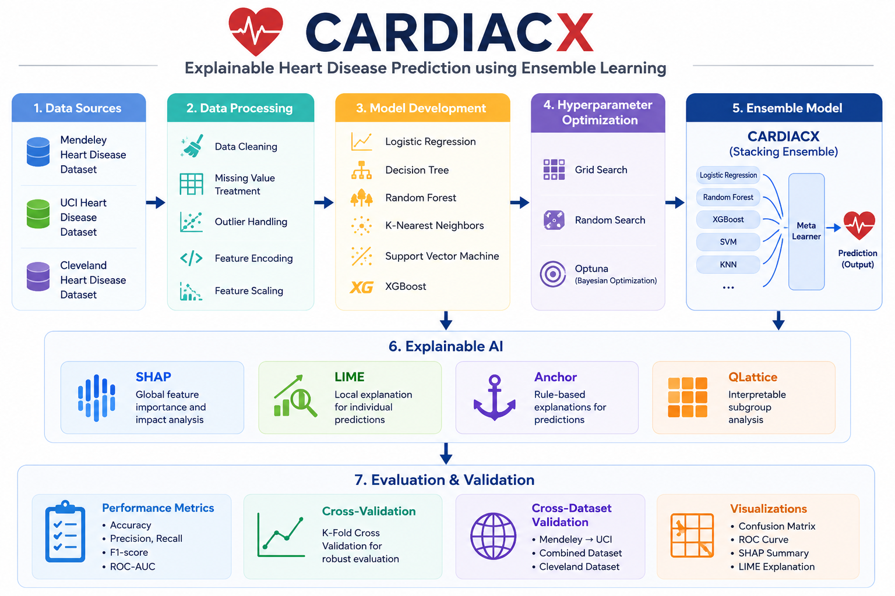
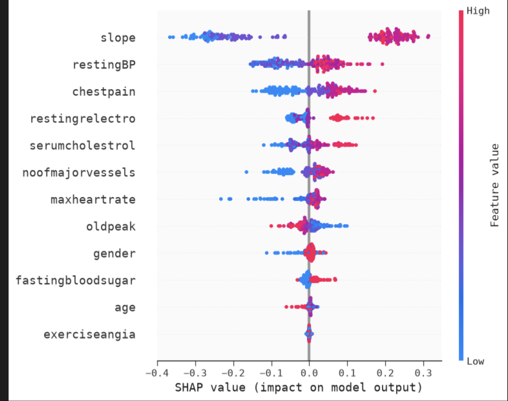
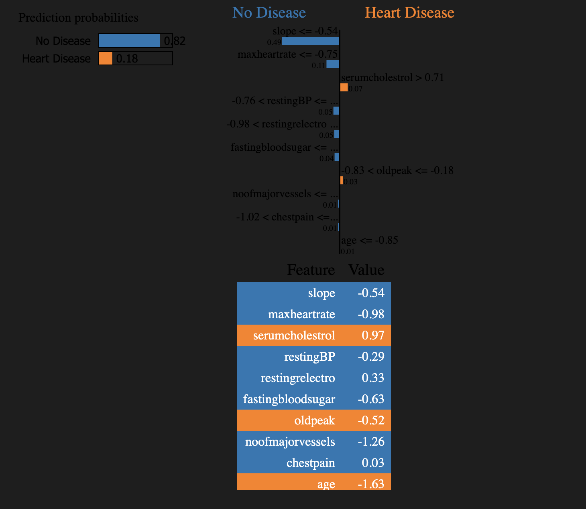
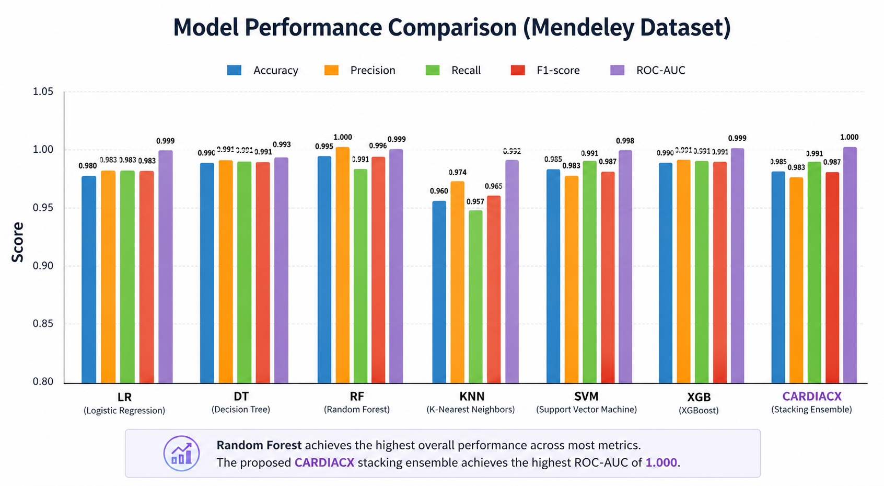

# CARDIACX

> **Explainable Heart Disease Prediction using Ensemble Learning, Explainable AI, and Cross-Dataset Validation**

<p align="center">


</p>

---

# Motivation

Heart disease remains one of the leading causes of mortality worldwide. Reliable and interpretable machine learning models can assist clinicians in early risk assessment while maintaining transparency through explainable AI techniques.

# Overview

CARDIACX is an end-to-end machine learning framework for **heart disease prediction** that combines ensemble learning, hyperparameter optimization, explainable AI, and external cross-dataset validation.

The project is trained on the **Mendeley Heart Disease Dataset**, interprets model predictions using multiple Explainable AI techniques, and evaluates model generalization on independent datasets from the UCI Heart Disease repository.

---

# Highlights

* End-to-end machine learning pipeline
* Exploratory Data Analysis (EDA)
* Data preprocessing and feature engineering
* Hyperparameter optimization using Grid Search, Random Search, and Optuna
* CARDIACX Stacking Ensemble
* Explainable AI using SHAP, LIME, Anchor, and QLattice
* Cross-dataset validation
* Multi-hospital generalization study
* Modular and reusable project structure

---

# Project Workflow

<p align="center">

</p>

---

# Models Evaluated

* Logistic Regression
* Decision Tree
* Random Forest
* K-Nearest Neighbors
* Support Vector Machine (SVM)
* XGBoost
* **CARDIACX Stacking Ensemble**

---

# Hyperparameter Optimization

Each machine learning model was optimized using:

* Grid Search
* Random Search
* Optuna

The best-performing hyperparameters were used to train the final models and construct the CARDIACX stacking ensemble.

---

# Explainable AI

CARDIACX incorporates multiple Explainable AI techniques to improve model transparency and interpretability.

### SHAP Summary Plot

<p align="center">

</p>

### LIME Prediction Explanation

<p align="center">

</p>

Explainability techniques used:

* SHAP
* LIME
* Anchor
* QLattice

These methods provide both global and local explanations, making model predictions easier to interpret for clinical decision support.

---

# Results

# Performance Comparison

Comparison of the evaluated machine learning models on the Mendeley Heart Disease dataset.

<p align="center">
  
</p>

---


## Mendeley Dataset

| Model               | Accuracy | Precision |  Recall | F1-score | ROC-AUC |
| ------------------- | -------: | --------: | ------: | -------: | ------: |
| Logistic Regression |    0.980 |    0.983 |  0.983 |   0.983 |  0.999 |
| Decision Tree       |    0.990 |    0.991 |  0.991 |   0.991 |  0.993 |
| Random Forest       |    0.995 |    1.000 |  0.991 |   0.996 |  0.999 |
| KNN                 |    0.960 |    0.974 |  0.957 |   0.965 |  0.992 |
| SVM                 |    0.985 |    0.983 |  0.991 |   0.987 |  0.998 |
| XGBoost             |    0.990 |    0.991 |  0.991 |   0.991 |  0.999 |
| **CARDIACX**        |  **0.985** | **0.983** | **0.991** | **0.987** | **1.000** |

---

## External Validation (Train on Mendeley → Test on UCI)

| Model        | Accuracy | Precision |  Recall | F1-score | ROC-AUC |
| ------------ | -------: | --------: | ------: | -------: | ------: |
| **CARDIACX** |  **0.558** |   **0.698** | **0.468** |  **0.560** | **0.657** |

---

## Combined Dataset Evaluation

| Model        | Accuracy | Precision |  Recall | F1-score | ROC-AUC |
| ------------ | -------: | --------: | ------: | -------: | ------: |
| **CARDIACX** |  **0.884** |   **0.894** | **0.910** |  **0.902** | **0.956** |

---

## Cleveland External Evaluation

| Model        | Accuracy | Precision |  Recall | F1-score | ROC-AUC |
| ------------ | -------: | --------: | ------: | -------: | ------: |
| **CARDIACX** |  **0.743** |   **0.683** | **0.820** |  **0.745** | **0.810** |

---

# Cross-Dataset Validation

The robustness of CARDIACX was evaluated through multiple validation scenarios:

* Train on Mendeley → Test on UCI
* Train on Combined Dataset → Test Split
* Train on Combined Dataset → Test on Cleveland Dataset
---

# Repository Structure

```text
CARDIACX/
│
├── data/
│   ├── raw/
│   └── processed/
│
├── notebooks/
│   ├── 01_Mendeley_EDA.ipynb
│   ├── 02_Mendeley_Preprocessing.ipynb
│   ├── 03_Model_Experiments.ipynb
│   ├── 04_Explainability.ipynb
│   ├── 05_UCI_EDA.ipynb
│   ├── 06_UCI_Preprocessing.ipynb
│   └── 07_Cross_Dataset_Validation.ipynb
│
├── src/
│   ├── models.py
│   ├── tuning.py
│   ├── stacking.py
│   └── evaluation.py
│
├── saved_models/
├── results/
├── docs/
│   └── images/
│
├── requirements.txt
├── README.md
├── LICENSE
└── .gitignore
```

---

# Installation

```bash
git clone https://github.com/<your-username>/CARDIACX.git

cd CARDIACX

pip install -r requirements.txt
```

---

# Running the Project

Execute the notebooks in the following order:

1. 01_Mendeley_EDA.ipynb
2. 02_Mendeley_Preprocessing.ipynb
3. 03_Model_Experiments.ipynb
4. 04_Explainability.ipynb
5. 05_UCI_EDA.ipynb
6. 06_UCI_Preprocessing.ipynb
7. 07_Cross_Dataset_Validation.ipynb

---

# Technologies Used

* Python
* NumPy
* Pandas
* Matplotlib
* Scikit-learn
* XGBoost
* Optuna
* SHAP
* LIME
* Anchor
* QLattice
* Joblib

---

# Future Work

* Evaluate transformer-based and deep neural network models on larger clinical datasets.
* Federated learning for privacy-preserving healthcare
* Multi-class cardiovascular disease prediction
* Real-time clinical decision support system

---

# Author

**Vamshi**

B.Tech in Artificial Intelligence
National Institute of Technology Karnataka (NITK), Surathkal
